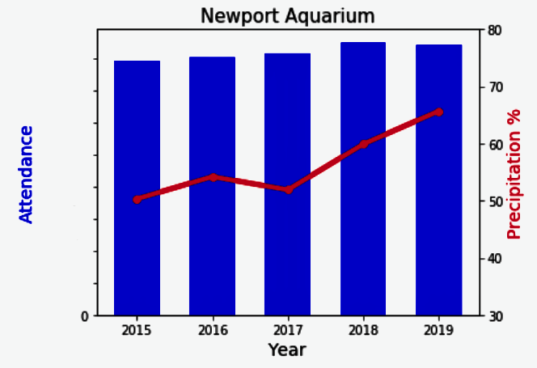
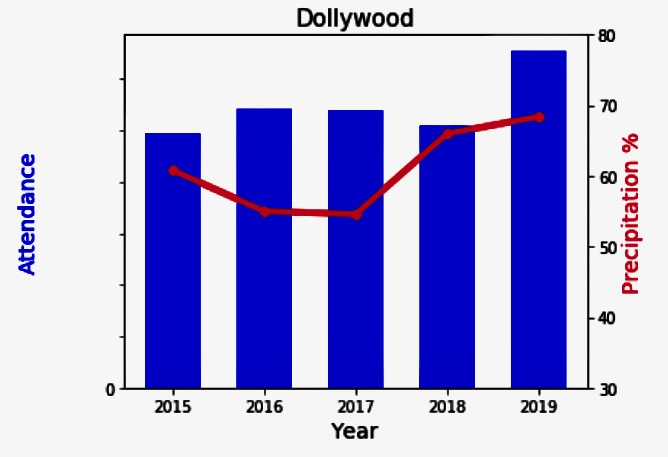
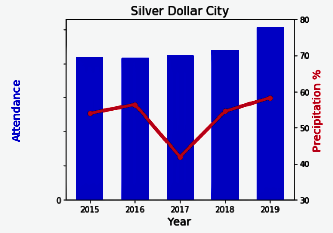
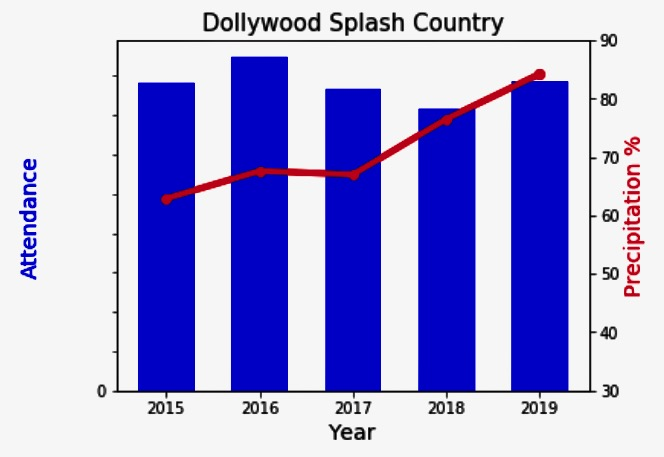

# Weather Impact Analysis on Attraction Attendance 

## Purpose 
How does weather impact attendance at Theme Park, Water Park and Acquarium Attractions?

## Data Source
* Pulled Historical Weather data (2015-2019) from WorldWeather Online API [WorldWeather Online API](https://www.worldweatheronline.com/developer/).

* Reviewed 5 year (2015-2019) attendance data from 6 attractions in USA [Attractions](https://www.hfecorp.com/our-businesses/):
    - Aquariums: Adventure Acquarium and Newport Aquarium
    - Theme Parks: Dollywood and Silver Dollar City
    - Water Parks: Dollywood Splash Country and White Water

## Tools Used
Matplotlib, Python, WorldWeather Online API 

## Methodology
* Gathered historical weather data from WorldWeather Online API, and compared attendance on each day to the weather data of that day.
* Pulled weather data for each attraction location based on zip code. 
* Added zip code column to Attendance dataframe to enable merging with Weather API data
* Merged the attendance and weather Dataframes based on date.
* Focused on Percipitation, comparing the % of days impacted by precipitation versus total annual attendance. 
* Calculated percentage of days impacted via True or False Analysis. 

## Findings

* Charts showing annual attendance plotted by year shown against percentage of operating days with precipitation impact.
* Displaying attendance and precipitation percentage, using the twinx method to show twin Axes object that shares same x-axis (Year).  

### Aquariums

<table>
  <tr>
    <td>Adventure Aquarium</td>
     <td>Newport Aquarium</td>
  </tr>
  <tr>
    <td valign="top"></td>
    <td valign="top"></td>
  </tr>
 </table>

 ### Theme Parks

<table>
  <tr>
    <td>Dollywood</td>
     <td>Silver Dollar City</td>
  </tr>
  <tr>
    <td valign="top"></td>
    <td valign="top"></td>
  </tr>
 </table>

### Water Parks

<table>
  <tr>
    <td>Dollywood Splash Country</td>
     <td>White Water</td>
  </tr>
  <tr>
    <td valign="top"></td>
    <td valign="top"></td>
  </tr>
 </table>